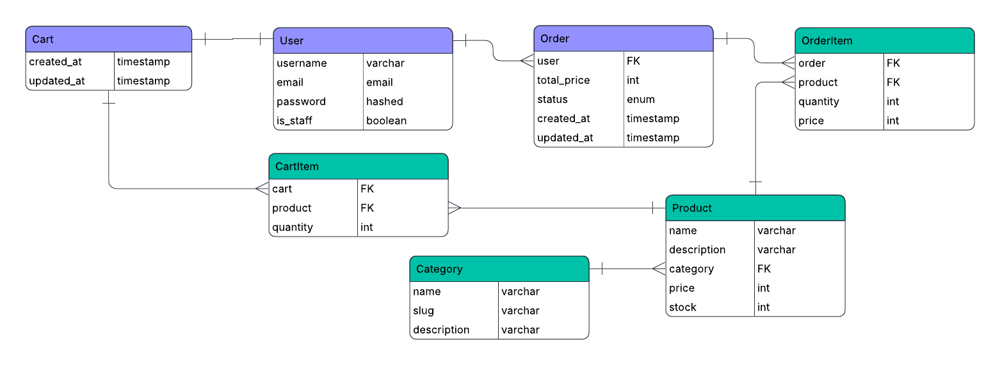

# Architecture and Design: Design Document Specification (DDS)

This document outlines the architecture and design of the MVP e-commerce API, detailing the system's structure, components, and interactions.

## 1. System Architecture
The application will be built as a **Monolithic REST API** using the **Django REST Framework**. This architecture is chosen for its rapid development speed and simplicity, which is ideal for an MVP.

*   **Framework:** Django & Django REST Framework
*   **Database:** PostgreSQL
*   **Authentication:** JWT (JSON Web Tokens)
*   **Containerization:** Docker & Docker Compose

## 2. Database Design

### 2.1. Entity-Relationship Diagram (ERD)

### 2.2. Entities and Relationships

This section provides the detailed blueprint for the database schema.

**1. User (Django Built-in)**
*   **Attributes**: `username`, `email`, `password` (hashed), `is_staff` (for Admin role).
*   **Relationships**:
    *   One-to-One with `Cart` (a user has one cart).
    *   One-to-Many with `Order` (a user can have multiple orders).

**2. Category**
*   **Attributes**: `name`, `slug` (for URL-friendly identifiers), `description`.
*   **Relationships**:
    *   One-to-Many with `Product` (one Category can have many Products).

**3. Product**
*   **Attributes**: `name`, `description`, `price`, `stock_quantity`.
*   **Relationships**:
    *   Many-to-One with `Category` (a Product belongs to one Category).
    *   One-to-Many with `CartItem` (a Product can be in many CartItems).
    *   One-to-Many with `OrderItem` (a Product can be in many OrderItems).

**4. Cart**
*   **Attributes**: `created_at`, `updated_at`.
    *   *Note: `total_price` is intentionally excluded. It will be calculated dynamically from `CartItem`s to ensure accuracy.*
*   **Relationships**:
    *   One-to-One with `User` (a Cart belongs to one User).
    *   One-to-Many with `CartItem` (a Cart can have multiple CartItems).

**5. CartItem**
*   **Attributes**: `quantity`.
    *   *Note: `price` is excluded. The current price will always be fetched from the related `Product`.*
*   **Relationships**:
    *   Many-to-One with `Cart` (a CartItem belongs to one Cart).
    *   Many-to-One with `Product` (a CartItem refers to one Product).

**6. Order**
*   **Attributes**: `total_price`, `status` (e.g., 'pending', 'completed'), `created_at`, `updated_at`.
    *   *Note: `total_price` is stored here to create a permanent historical record of the final transaction amount.*
*   **Relationships**:
    *   Many-to-One with `User` (an Order belongs to one User).
    *   One-to-Many with `OrderItem` (an Order can have multiple OrderItems).

**7. OrderItem**
*   **Attributes**: `quantity`, `price`.
    *   *Note: The `price` is stored here to create a "snapshot in time". This ensures that even if the Product's price changes later, the order history remains accurate.*
*   **Relationships**:
    *   Many-to-One with `Order` (an OrderItem belongs to one Order).
    *   Many-to-One with `Product` (an OrderItem refers to one Product).

## 3. API Endpoint Design

This section defines the API contract based on the functional requirements.

### 3.1. Authentication & User Endpoints
*   `POST /api/v1/auth/register/`
    *   **Description**: Creates a new user account.
*   `POST /api/v1/auth/login/`
    *   **Description**: Authenticates a user and returns both `access` and `refresh` JWT tokens.
*   `POST /api/v1/auth/token/refresh/`
    *   **Description**: Accepts a valid `refresh` token and returns a new, short-lived `access` token.
*   `POST /api/v1/auth/logout/`
    *   **Description**: **(User Only)** Accepts a `refresh` token to blacklist it, effectively logging the user out from that device.
*   `GET, PUT, PATCH /api/v1/users/me/`
    *   **Description**: **(User Only)** Allows a logged-in user to view (`GET`) or update (`PUT`/`PATCH`) their own profile information (e.g., name, email).

### 3.2. Product & Category Endpoints
*   `GET /api/v1/products/`
    *   **Description**: Retrieves a paginated list of all products. Supports `search` and `category` query parameters for filtering.
*   `POST /api/v1/products/`
    *   **Description**: **(Admin Only)** Creates a new product.
*   `GET /api/v1/products/{id}/`
    *   **Description**: Retrieves the details of a single product.
*   `PUT/PATCH /api/v1/products/{id}/`
    *   **Description**: **(Admin Only)** Updates an existing product.
*   `DELETE /api/v1/products/{id}/`
    *   **Description**: **(Admin Only)** Deletes a product.
*   `GET /api/v1/categories/`
    *   **Description**: Retrieves a list of all product categories.

### 3.3. Cart Endpoints
*   `GET /api/v1/cart/`
    *   **Description**: **(User Only)** Retrieves the current user's shopping cart and its items.
*   `POST /api/v1/cart/add/`
    *   **Description**: **(User Only)** Adds a product to the cart or updates the quantity of an existing item.
*   `PUT /api/v1/cart/item/{item_id}/`
    *   **Description**: **(User Only)** Updates the quantity of a specific item in the cart.
*   `DELETE /api/v1/cart/item/{item_id}/`
    *   **Description**: **(User Only)** Removes an item from the cart.

### 3.4. Order Endpoints
*   `POST /api/v1/orders/`
    *   **Description**: **(User Only)** Creates a new order from the user's cart.
*   `GET /api/v1/orders/`
    *   **Description**: **(User Only)** Retrieves a list of the current user's past orders.
*   `GET /api/v1/orders/{id}/`
    *   **Description**: **(User Only)** Retrieves the details of a specific past order.
